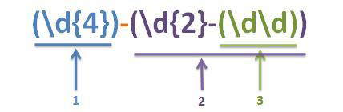

# 正则表达式 

## 反向引用（Backreferences)  
> 存储匹配的模式的一部分以供以后重新使用的能力，对前面捕获组捕获的内容进行引用  

### 捕获组  
捕获组编号原则: 按照`(`出现的顺序，按照从做到右，从1开始编号  
 

字符串： http://msdn.microsoft.com:80/scripting/default.htm  
正则表达式：(\w+):\/\/([^/:]+)(:\d*)?([^# ]*)  

* \1: http
* \2: msdn.microsoft.com
* \3: :80
* \4: /scripting/default.htm

### 原理  
捕获组(Expression)在匹配成功时，会将子表达式匹配到的内容，保存到内存中一个以数字编号的组里，可以简单的认为是对一个局部变量进行了赋值。  
一个捕获组(Expression)在匹配成功之前，它的内容可以是不确定的，一旦匹配成功，它的内容就确定了，反向引用的内容也就是确定的了。  

### 例子  
字符串：aabcdebbcde  
正则表示式：（[ab])\1  
匹配结果：aa bb  

字符串：aabcdebbbcde  
正则表示式：（[ab])\1{2}  
匹配结果： bbb   

### 阅读博文  
[ 正则基础之——反向引用](http://blog.csdn.net/lxcnn/article/details/4476746)  


# Node  

## Node.js是什么  
服务器端的javascript，宿主环境是V8引擎。   
## Node.js语言  
核心模块`http`,`fs`,`net`由C/C++实现，外部用JavaScript封装。 
## Node的由来  
  
Node.js的创始人Ryan Dahl    

[Node.js与io.js那些事儿](http://www.infoq.com/cn/articles/node-js-and-io-js)

## Node.js可以什么  
### 快速搭建一个服务器  

```javascript  
var http = require('http');

http.createServer(function (request, response) {
    response.writeHead(200, { 'Content-Type': 'text-plain' });
    response.end('Hello World\n');
}).listen(3000);  
```

### MongoDB(C++)  
### Express 
node.js Web应用开发框架  
### Mongoose